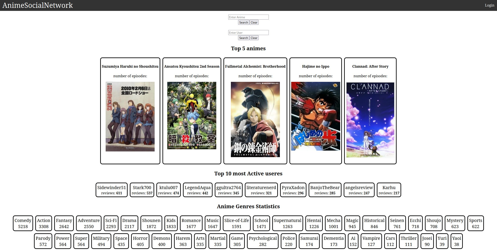

# Anime social network

This project is a part of the course "DB workshop" in BIU.

Our project is a social network website which interacts with a relational databse (mySQL).

click here to download the baseline datasets for the database ->
[download baseline](https://drive.google.com/file/d/1_HYv4kdyX0s5kS6Rb3PeHkFs09XoV7W1/view?usp=share_link)

## Requirements
* pip - for installing python dependencies for data uploading scripts.
* node
* npm - for installing node_modules 

## database setup

* download the tables data (link above).
* place the tables 'csv' files in the folder ***./website/backend/tables_csv/***
* have mySql server installed locally and running.
* go to website folder, and install python scripts dependencies with pip using the requirments file.
   
   ```pip install -r requirments.txt```
 
* in the file ***./website/backend/globals.py*** enter your db credentials.
* run ```./website/backend/run```  script to:

    1. create 'anime' databse.
    2. create the database tables.
    3. upload to the database. 
    

* if you want to reset the tables back to baseline, run ```./website/backend/reset``` script. 
* a ```./website/backend/clean``` script is also provided, this script will delete all the data in the tables.

## App Installation

* run ```npm instal``` in both ***client*** and ***server*** dirctories.

## Running the application
* run ```node index.js``` in the ***server*** directory to start the back-end server of the application. 
* run ```npm start``` in the ***client*** directory to start the front-end of the application. 


 
